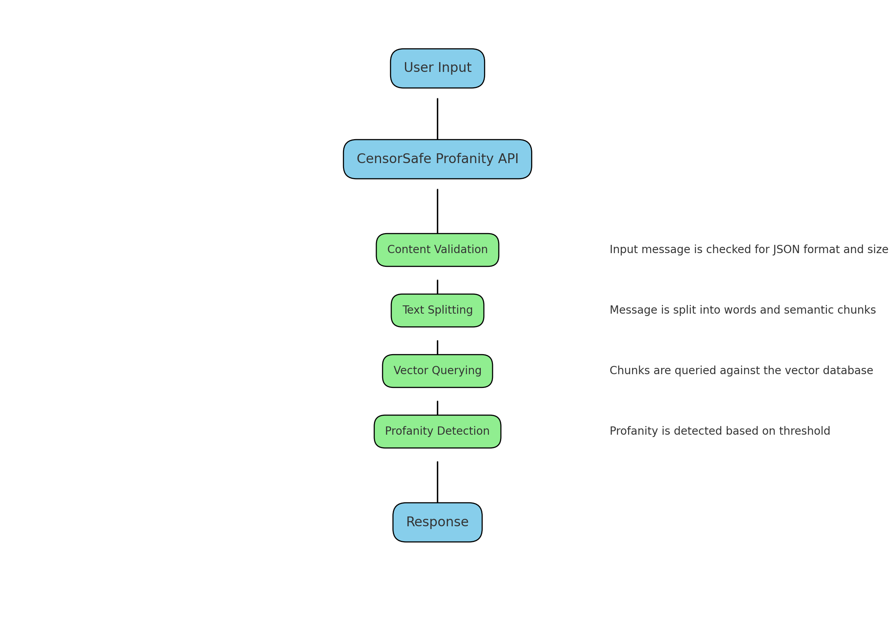
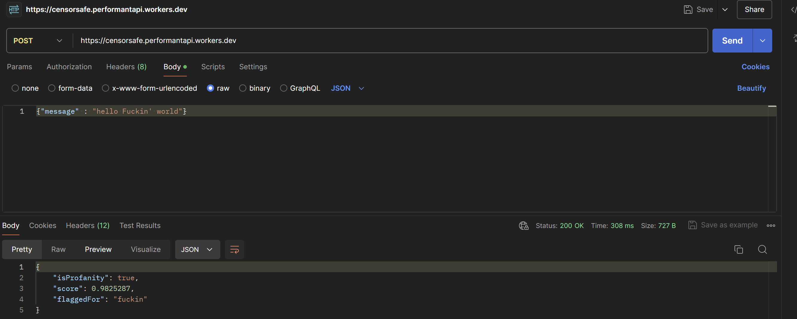
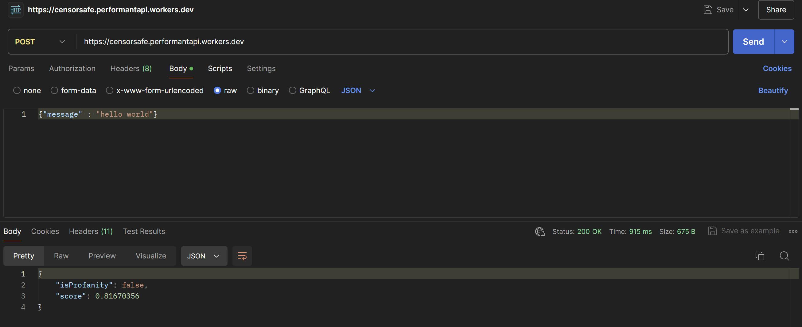

# CensorSafe Profanity API ✅

<center>



</center>

## 🎧 Introduction

In today's digital world, ensuring clean and respectful communication across platforms is a significant challenge. Whether it's in social media, online gaming, or collaborative workspaces, the need to detect and filter out offensive language is more important than ever. The development of the CensorSafe Profanity API addresses this critical need, providing a robust solution for detecting and handling profanity in text.

## 👀 Overview

The **CensorSafe Profanity API** is designed to efficiently identify and filter out profane words from user-generated content. Built with scalability, availability, and performance in mind, this API leverages advanced text processing and vector-based semantic analysis to accurately detect offensive language.

## 🚀 Features

- **Scalable and Highly Available:** The API is designed to handle high volumes of requests with low latency, making it suitable for use in large-scale applications.
- **Semantic Analysis:** Uses vector-based semantic analysis to detect profane language beyond simple keyword matching.
- **Configurable Thresholds:** Adjustable profanity threshold to fine-tune sensitivity based on application needs.
- **Whitelist Management:** Allows for customization of whitelisted words to prevent false positives.

## ⚡ Technologies Used
- **Hono Framework:** A small, fast, and modern web framework for building scalable APIs.
- **Upstash Vector:** A vector database service optimized for performance and scalability.
- **LangChain:** A toolkit for building language model applications with advanced text processing capabilities.
- **TypeScript:** A strongly typed programming language that builds on JavaScript, providing better tooling at scale.
- **Cors Middleware:** Middleware to enable Cross-Origin Resource Sharing (CORS), allowing your API to be accessed from different - domains.

## 🔗 API Endpoint

### URL (Use 🧑‍🚀``` Postman ``` to Make a Query)
``` 
https://censorsafe.performantapi.workers.dev 
```

### ``` POST ``` Request
```
URL: /
Content-Type: application/json
```

### Request Body
```
{
  "message": "Your text message here"
}
```

### Response

- Without Profane Word:

<center>



</center>

```
{
  "isProfanity": false,
  "score": 0.42
}
```

- With Profane Word:

<center>



</center>

```
{
  "isProfanity": true,
  "score": 0.42,
  "flaggedFor": "your profane word"
}
```

## 🧾 Installation and Setup

1. Clone the repository:

```
git clone https://github.com/your-repo/censorsafe-profanity-api.git
```

2. Install dependencies:

```
cd censorsafe-profanity-api
npm install
```

3. Set up environment variables:

```
export VECTOR_URL="your_vector_url"
export VECTOR_TOKEN="your_vector_token"
```

4. Start Server:

```
npm start
```

## 📖 Conclusion :

- CensorSafe Profanity API is a robust and scalable solution for detecting and handling profanity in text.
- It utilizes advanced text processing and vector-based semantic analysis to accurately identify and filter out offensive language.
- The API is designed to be highly available and scalable, making it suitable for use in large-scale applications.
